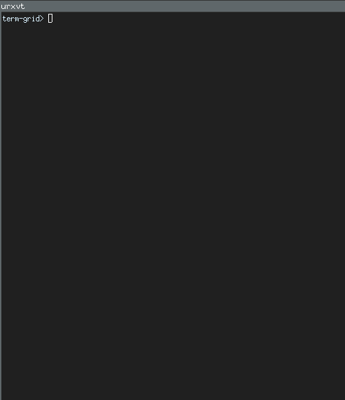

Terminal Grid
=============

Treat the terminal like a grid of colored (foreground and background) text cells.

Develop
-------

    ./gradlew build
    ./gradlew test

Documentation
-------------

    ./gradlew javadoc

Visual test
-----------

    sh test.sh
